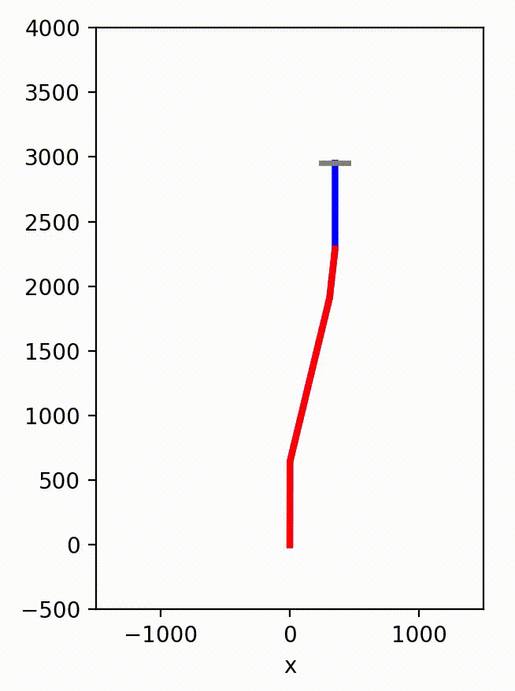

# Landing Sim
Inspired by the superheavy catch on October 13th, 2024, I had some spare time and wanted to try and develop a model predictive controller (MPC) that is capable or replicating a booster or ship catch. 

## How intelligent?
"Replicate a booster or ship catch" is a pretty broad goal, so let me outline what it's capable of, and where it falls short. 
### What it does:
- Determines when's the best time to light the engines.
- Knows that the engines have a minimum and maximum thrust.
- Knows that the engines have a maximum gimbal range.
- Knows that the engines burn fuel which reduces the mass, effecting vehicle dynamics.
- Knows that it cannot shutdown the engines until it's been caught.
- Knows when that it must stop at the "arms" in order to be caught.
- Understands some disturbances like gravity and drag (simply modeled as quadratic drag)
### What it doesn't do:
- It is nowhere near realtime lol. I'm using Bonmin and it takes about 45s for every timestep.
- The simulation uses the same model as the MPC, proving it's able to find a trajectory and follow it, but not that it is robust to model errors.
- It has some issues with numeric stability. Not sure what's causing them as I haven't had time to dive into the solver.
- Drag is assumed to be only dependent on velocity, so is not effected by body angle. This also means there is no lift.
- It does not model or control the flaps.
- There is only one engine. There is no fine control over individual engines or consideration of engine failures.
## Problem Formulation
To handle binary values for landing burn startup and catch, I'm using the Mixed-Integer Non-Linear Program (MINLP) solver Bonmin. 
Bonmin isn't a global solver but it branches on the integer values. This allows it to assume it is caught at each timestep and then work backwards to find a feasible solution. 
You can read through the code for details.
### Parameters
- $md$ Dry mass
- $tf_min$ Min thrust
- $tf_max$ Max thrust
- $th_max$ Max body angle
- $phi_max$ Max engine gimbal angle
- $L$ Body length
- $N$ Number of steps in horizon
- $M$ M used for big M constraint to enforce catch condition. There's some numerical precision issues, so might be worth adding a second broad one so that the final one can have lower M
- $c$ Coefficient of mass rate / thrust. Equal to 1/specific impulse
- $d$ Drag coefficient
- $dt[t]$ Array of timestep lengths
- Various cost parameters
- Initial condition for all variables
### Decision Variables
- $LB$ Landing burn. Is 1 when burning, cannot move from 1 to 0
- $TR$ Transient. 1 when flying, goes to zero when caught
- $x$ X position. 0 assumed to be landing spot
- $y$ Y position. 0 assumed to be landing spot
- $th$ Theta or body angle (ccw positive from upright) of ship/booster
- $xd$ X dot or X velocity
- $yx$ Y dot or Y velocity
- $thd$ Theta dot or angular rate
- $m$ Mass
- $tf$ Thrust force
- $tfa$ Thrust force (actual). 0 when LB is zero or TR is zero, otherwise equals tf
- $phi$ Thrust gimbal angle (ccw positive from pointing straight out the back)
### Objective Function
Essentially a quadratic cost function but its NLP so we can adjust it as needed. 
Minimize QTR\*TR^2 + QLB\*LB^2 - Qm\*m^2 - Rtfa\*tf^2
### Constraints
- LB[t] is Binary
- TR[t] is Binary
- -th_max <= th[t] <= th_max (no backflips, please)
- m[t] >= md (keep mass above dry mass)
- tf_min <= tf[t] <= tf_max (box constrain thrust)
- -phi_max <= phi[t] <= phi_max (gimbal angle)
- tfa[t] + tf[t] \* LB[t] \* TR[t] (actual thrust applies if landing burn and not caught)
- x[t]^2 + y[t]^2 + th[t]^2 + xd[t]^2 + yd[t]^2 + thd[t]^2 <= 1 + M \* TR[t] (Unless lhs < 1, TR must be 1)
- x[0]^2 + y[0]^2 + th[0]^2 + xd[0]^2 + yd[0]^2 + thd[0]^2 <= 2 + M \* TR[0] (for numeric stability)
- LB[t + 1] >= LB[t] (can't turn off landing burn)
- m[t + 1] = m[t] - c*dt[t]\*tfa[t] (mass drops from thrust)
- x[t + 1] = TR[t]\*(x[t] + dt[t]\*(xd[t] + xd[t + 1])/2) (X position update with trapazoid discrete integration)
- y[t + 1] = TR[t]\*(y[t] + dt[t]\*(yd[t] + yd[t + 1])/2) (Y position update with trapazoid discrete integration)
- th[t + 1] = TR[t]\*(th[t] + dt[t]\*(thd[t] + thd[t + 1])/2) (Theta update with trapazoid discrete integration)
- xd[t + 1] = TR[t]\*(xd[t] - dt[t]\*sin(th[t] + phi[t])\*tfa[t]/m[t]) (X velocity update)
- yd[t + 1] = TR[t]\*(yd[t] + dt[t]\*(cos(th[t] + phi[t])\*tfa[t]/m[t] - 9.8 + d\*yd[t]^2/m[t])) (Y velocity update)
- thd[t + 1] = TR[t]\*(thd[t] - dt[t]\*4\*sin(phi[t])\*tfa[t]/(L*m[t])) (Theta velocity update)
- yd[t + 1] >= yd[t] (Prevent negative acceleration)
- Intial conditions for all decision variables

## Dynamic Rate
I had an idea for Autodrive (self-driving car team). What if you have the rate of your MPC decay throughout the horizon. So nearby in time, the rate is high, but as it predicts farther into the future, the simulation fidelity decreases? 
I asked a few grad students and none of them have seen it done so I wanted to test it out on this project as it very much applies. 
Since it's just a constrained optimization, there is no reason why you can't vary dt, so I define $dt[t]=dt_0e^{dt_d\cdot t}$. 
If you've heard of this or done this, please reach out to me! I'm very interested in hearing more.
So does it work??? Yes and no. It does allow for prediction long into the future (30 s horizon from 10 steps at 4 Hz) but it has it's issues too. 
Since your last timestep is very long, you typically do a ton in it. The problem is that as it shimmies forward in time, things move around and that causes oscillations to move up the trajectory (you can see it in some videos). 
I think this situation is pushing it to it's limit as finding a catch trajectory is HARD. It seems much better on a car where all you need to do is stop for the red light ahead and slow down for the curve. 
Overall, pretty awesome, will try it again on our car.

# Installation
If you'd like to mess around with it, here are the steps. 
`python3 -m venv venv` 
`source venv/bin/activate` 
`python -m pip install amplpy --upgrade` 
`python -m amplpy.modules install coin` 
`python -m amplpy.modules activate <Your Ampl UUID>` 
Now you can run it. Make sure to always source the venv in any new terminal 
`python solve.py` 
After some time you will have a ship.mov file which has your animation!

